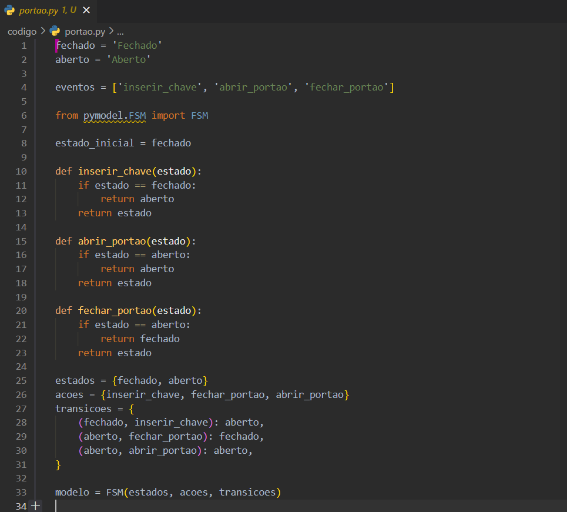
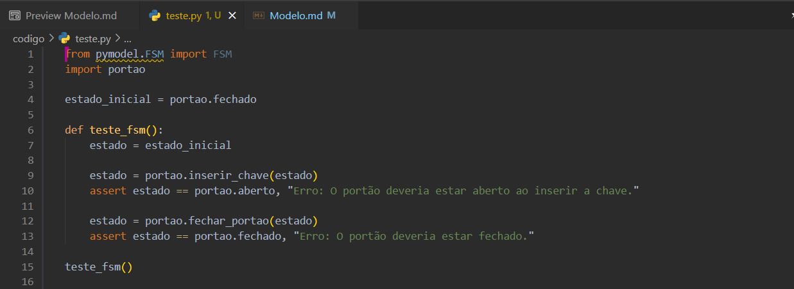

 
# Testes Baseados em Máquinas de Estados Finitos
### Prof. Dr. Valério Gutemberg
#### :pencil: Discente: Moisés, Rafael Augusto, Alessandro, Guilherme Cadete
#### :pencil: Disciplina de Testes de Software
:pencil2: Curso de Sistemas para Internet

--- 
## O que é uma Máquinas de Estados Finitos (FSM)?

- **FSM**: É um modelo matemático composto por um número finito de estados, transições entre esses estados, e ações que podem ocorrer em cada estado. Significa, em resumo, que é uma máquina que só pode ter um estado por vez e precisa de uma forma de transicionar entre estados.

---
## Exemplo de código simples

 

---
## Exemplo de teste

---
## Explicação

- Nos códigos mostrados, simulamos um FSM (Finite State Machine) para simular a abertura e fechamento de um portão.
- **aberto** e **fechado** são os estados que o portão pode assumir. Nunca pode estar aberto e fechado ao mesmo tempo.
- **inserir_chave**, **abrir_portao** e **fechar_portao** são transições de estado.

---
## Tecnologias de FSM

### PyModel (python)
A biblioteca que utilizamos e uma alternativa simples para montar testes e criar máquinas de estado finito: precisamos apenas informar os estados, as transições e as ações(que executam a transição).

###### Outras alternativas são o **TestFSM (com Rust)** e o **GraphWalker**, ambos para teste

---

## Conclusão
e. A FSM é uma poderosa ferramenta para modelar sistemas que têm um conjunto finito de estados e um conjunto definido de transições entre esses estados. Exemplos de usos são semáforos, portões e situações parecidas

---

# Obrigado!

Dúvidas?

