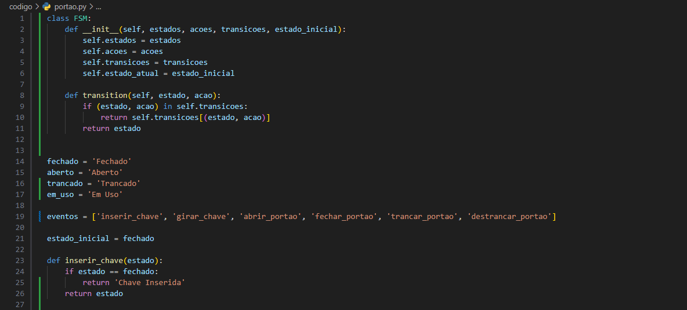
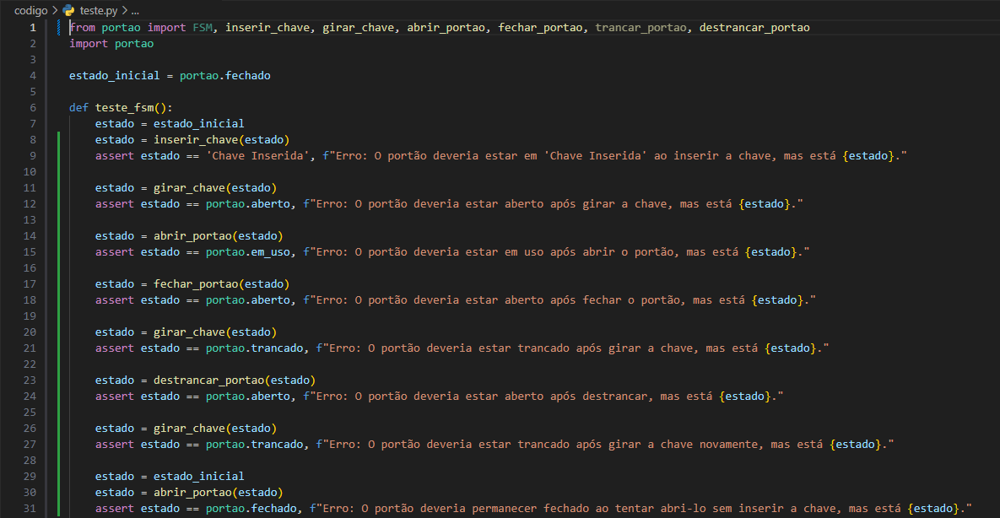

 
# Testes Baseados em Máquinas de Estados Finitos
### Prof. Dr. Valério Gutemberg
#### :pencil: Discente: Alessandro, Guilherme Cadete, Moisés, Rafael Augusto, Samuel Lucas
#### :pencil: Disciplina de Testes de Software
:pencil2: Curso de Sistemas para Internet

--- 
## Introdução

O teste de software é uma atividade essencial para assegurar a qualidade de um sistema, identificando falhas o mais cedo possível no ciclo de desenvolvimento. 
Como testar todas as possíveis execuções de um software é inviável, técnicas e critérios específicos são necessários para selecionar casos de teste com alta probabilidade de revelar falhas, garantindo a viabilidade prática dos testes.

--- 
## Introdução

Uma técnica amplamente adotada na indústria é o Teste Baseado em Modelos, que utiliza modelos comportamentais derivados dos requisitos funcionais do software para orientar o processo de teste. Entre as diversas abordagens, as Máquinas de Estados Finitos(Autômatos Finitos) se destacam por sua eficácia em modelar sistemas reativos e controlados por eventos, além de sua ampla aplicabilidade em diferentes tipos de sistemas.

--- 
## O que é uma Máquinas de Estados Finitos (FSM)?

- **FSM**: É um modelo matemático composto por um número finito de estados, transições entre esses estados, e ações que podem ocorrer em cada estado. Significa, em resumo, que é uma máquina que só pode ter um estado por vez e precisa de uma forma de transicionar entre estados.

---
## Como Funcionam os Testes Baseados em FSMs?
- **Modelagem do Sistema:**: sob teste como uma FSM, definindo os estados, transições, eventos, entradas e saídas.

- **Definição dos Testes**: Com a FSM definida, elaboram-se casos de teste para cobrir diversos cenários e transições entre estados, verificando se o sistema responde corretamente a entradas e eventos em cada estado.
- **Execução dos Testes**: Os testes são então executados, e o comportamento real do sistema é comparado com o comportamento esperado baseado na FSM.

- **Análise dos Resultados**: Caso haja divergências entre o comportamento esperado e o observado, o sistema é analisado para identificar e corrigir possíveis falhas.

---
## Finite State Machine em Jogos Eletrônicos

As FSMs desempenham um papel crucial no desenvolvimento e teste de jogos eletrônicos. Elas não apenas ajudam a estruturar o comportamento dos personagens e a lógica do jogo, mas também oferecem uma base sólida para realizar testes eficientes e abrangentes. Este enfoque nas MEFs permite uma abordagem sistemática para verificar se os diferentes estados e transições estão funcionando corretamente, garantindo uma experiência de jogo robusta e livre de falhas.

---
## Teste de Comportamento de Personagens
Nos jogos eletrônicos, personagens podem ter diversos estados, como "parado", "andando", "correndo", "pulando" e "atacando". Utilizar FSMs para modelar esses estados possibilita a criação de casos de teste focados em transições entre esses estados. Por exemplo, os testes podem verificar se a transição de "parado" para "andando" ocorre corretamente quando uma tecla é pressionada. Este tipo de teste ajuda a garantir que o comportamento do personagem esteja conforme o esperado em diferentes cenários de jogo.

---
## Figura 1 - Exemplo de Teste de Comportamento de Personagens

Fonte: Unity, 2022
---

---
## Teste da Inteligência Artificial (IA)
A IA dos inimigos e NPCs em jogos pode ser complexa, com estados como "patrulhando", "perseguindo", "atacando" e "fugindo". Testar essas transições usando FSMs permite verificar se a IA responde adequadamente às mudanças nas condições de jogo, como a aproximação do jogador ou alterações na saúde do inimigo. Os testes podem incluir simulações de diferentes cenários para assegurar que a IA se comporte de maneira previsível e eficiente em diversas situações.

---
## Figura 2 - Exemplo de teste de IA

Fonte: Augusto Baffa, 2016
---

---
## Teste do Fluxo de Jogo
No gerenciamento do fluxo geral do jogo, estados como "início", "jogando", "pausado", "game over" e "vencedor" podem ser modelados usando FSMs. Testar essas transições ajuda a garantir que o jogo passe corretamente de um estado para outro e que as regras e condições associadas a cada estado sejam seguidas rigorosamente. Por exemplo, os testes podem verificar se o jogo corretamente entra no estado "game over" quando o jogador perde, e se ele pode ser reiniciado sem problemas.

---
## Benefícios e Razões para Usar Testes Baseados em FSMs
- **Cobertura Completa:** Testes baseados em FSMs garantem a exploração de todos os cenários e transições do sistema, assegurando que todas as funcionalidades sejam testadas e que o sistema funcione corretamente em todos os possíveis estados.

- **Detecção Precoce de Defeitos:** A abordagem sistemática das FSMs facilita a identificação de falhas nas fases iniciais do desenvolvimento, permitindo a correção de problemas antes que se tornem mais complexos e difíceis de resolver.

---
## Benefícios e Razões para Usar Testes Baseados em FSMs
- **Melhoria da Qualidade:** Ao testar todas as transições e estados, a metodologia baseada em FSMs contribui para a criação de um software mais confiável e robusto, melhorando a qualidade geral do produto.

- **Eficiência e Automação:** A estrutura modular das FSMs simplifica a criação e execução de casos de teste, economizando tempo e recursos. Além disso, facilita a automação dos testes, permitindo verificações contínuas e repetidas à medida que o sistema evolui.

---
## Figura 3 -  Exemplo de código simples

 
Fonte: Autoria própria, 2024
---

---
## Figura 4 -  Exemplo de código simples

 
Fonte: Autoria própria, 2024
---

---
## Figura 5 -  Exemplo de código simples

 
Fonte: Autoria própria, 2024
---

---
## Figura 6 - Exemplo de teste

Fonte: Autoria própria, 2024
---

---
## Figura 7 - Exemplo de teste

Fonte: Autoria própria, 2024
---

---
## Explicação

- Nos códigos mostrados, simulamos um FSM (Finite State Machine) para simular a abertura e fechamento de um portão.
- **aberto** e **fechado** são os estados que o portão pode assumir. Nunca pode estar aberto e fechado ao mesmo tempo.
- **inserir_chave**, **abrir_portao** e **fechar_portao** são transições de estado.

---
## Tecnologias de FSM

### PyModel (python)
A biblioteca que utilizamos e uma alternativa simples para montar testes e criar máquinas de estado finito: precisamos apenas informar os estados, as transições e as ações(que executam a transição).

###### Outras alternativas são o **TestFSM (com Rust)** e o **GraphWalker**, ambos para teste

---

## Conclusão
e. A FSM é uma poderosa ferramenta para modelar sistemas que têm um conjunto finito de estados e um conjunto definido de transições entre esses estados. Exemplos de usos são semáforos, portões e situações parecidas

---
## Referências

- PUC. Máquinas de Estados em Jogos Eletrônicos. Disponível em: https://www.maxwell.vrac.puc-rio.br/4711/4711_3.PDF. Acesso em: 29 ago. 2024.
- FANTINATO, Marcelo. Teste de Software Baseado em Máquina de Estado Finito - Uma Revisão. Disponível em: https://sedici.unlp.edu.ar/bitstream/handle/10915/23121/Art_C165.pdf;jsessionid=72A87F4CF39ABC95A8403629E01AB409?sequence=1. Acesso em: 29 ago. 2024.

---
## Referências

- UNITY, Automated Tests Unity Test Framework. Disponível em: https://unity.com/pt/how-to/automated-tests-unity-test-framework. Acesso em: 29 ago. 2024.

- BAFFA, Augusto. INF 1771 – Inteligência Artificial. Rio de Janeiro: Vision Lab, 2016. 24 slides, color, 254 × 190 mm.

---

# Obrigado!

Dúvidas?

